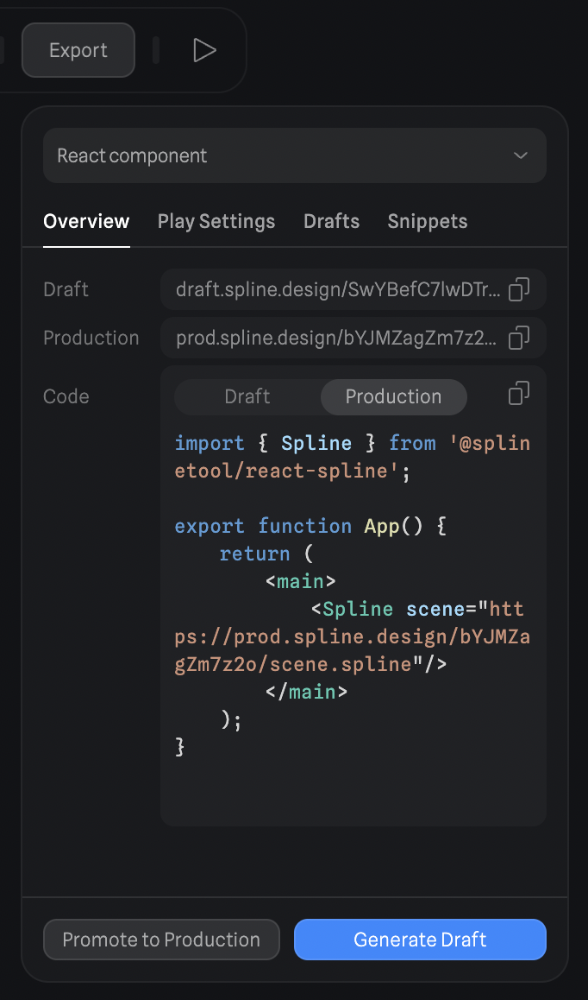

# react-spline

🌈 [Spline](https://spline.design/) is a friendly 3d collaborative design tool for the web.

**react-spline** allows you to export and use spline scenes directly in your React websites.

[Website](https://spline.design/) &mdash;
[Twitter](https://twitter.com/splinetool) &mdash;
[Discord](https://discord.gg/M9hNDMqvnw) &mdash;
[Documentation](https://docs.spline.design/)

## Table of Contents

- [Install](#install)
- [Usage](#usage)
  - [Read and modify Spline objects](#read-and-modify-spline-objects)
  - [Listen to events](#listen-to-events)
  - [Trigger Spline events from outside](#trigger-spline-events-from-outside)
- [API](#api)
  - [Spline Component Props](#spline-component-props)
  - [Spline App Methods](#spline-app-methods)
  - [Spline Events](#spline-events)
- [Contributing](#contributing)

## Install

```bash
yarn add @splinetool/react-spline @splinetool/runtime
```

or

```bash
npm install @splinetool/react-spline @splinetool/runtime
```

## Usage

To use react-spline, first you have to go to the Spline editor, click on the Export button and select "**React Component**".

Spline generates links for Development (Drafts) and Production.

Drafts are generated each time you press on "**Generate Draft**". This will create a new link with the current content of the scene. All previous drafts are stored under the "**Drafts**" tab.

You can use the drafts to try ideas, and once you are ready, you can **promote your drafts to production**.



Once you have a draft or production URL, you can start using the react-spline component in React.

```jsx
import { Spline } from '@splinetool/react-spline';

function App() {
  return (
    <main>
      <Spline scene="[DRAFT OR PROD URL]" />
    </main>
  );
}
```

### Read and modify Spline objects

You can query any Spline object via `findObjectById` or `findObjectByName`.

_(You can get the ID of the object in the `Develop` pane of the right sidebar)._

```jsx
import { Spline } from '@splinetool/react-spline'

function App() {
  const [myObj, setMyObj] = useState(null)

  function onLoad(spline) {
    const obj = spline.findObjectById('8E8C2DDD-18B6-4C54-861D-7ED2519DE20E')
    // or
    // const obj = spline.findObjectByName('my object')

    setMyObj(obj)
  }

  function moveObj() {
    console.log(myObj) // Spline Object => { name: 'my object', id: '8E8C2DDD-18B6-4C54-861D-7ED2519DE20E', position: {}, ... }

    // move the object in 3D space
    myObj.position.x += 10
  }

  return (
    <main>
      <Spline scene="[DRAFT OR PROD URL]" onLoad={onLoad}/>
      <button type="button" onClick={moveObj}/>
        Move {myObj.name}
      </button>
    </main>
  )
}
```

### Listen to events

You can listen to any Spline Event you set in the Events panel of the editor by attaching a listener to the Spline component.

```jsx
import { Spline } from '@splinetool/react-spline';

function App() {
  function onMouseDown(e) {
    if (e.target.id === '8E8C2DDD-18B6-4C54-861D-7ED2519DE20E') {
      // doSomething();
    }
  }

  return (
    <main>
      <Spline scene="[DRAFT OR PROD URL]" onMouseDown={onMouseDown} />
    </main>
  );
}
```

You can find a list of all of the Spline Event listeners in the [Spline Component Props](#spline-component-props) section.

### Trigger Spline events from outside

You can trigger any animation Event you set in the Events panel in the Spline Editor.

You can use the `emitEvent` function via the spline ref, passing the [event type](#spline-events) and the ID of your object.

_(You can get the ID of the object in the `Develop` pane of the right sidebar)._

```jsx
import { Spline } from '@splinetool/react-spline'

function App() {
  const [spline, setSpline] = useState()

  function onLoad(spline) {
    setSpline(spline)
  }

  function triggerAnimation() {
    spline.emitEvent('mouseHover', '8E8C2DDD-18B6-4C54-861D-7ED2519DE20E')
  }

  return (
    <main>
      <Spline scene="[DRAFT OR PROD URL]" onLoad={onLoad} />
      <button type="button" onClick={triggerAnimation}/>
        Trigger Spline Animation
      </button>
    </main>
  )
}

```

Or you can query the spline object first, and then trigger the event:

```jsx
import { Spline } from '@splinetool/react-spline'

function App() {
  const [objectToAnimate, setObjectToAnimate] = useState(null)

  function onLoad(spline) {
    const obj = spline.findObjectById('8E8C2DDD-18B6-4C54-861D-7ED2519DE20E')
    setObjectToAnimate(obj)
  }

  function triggerAnimation() {
    objectToAnimate.emitEvent('mouseHover')
  }

  return (
    <main>
      <Spline scene="[DRAFT OR PROD URL]" onLoad={onLoad} />
      <button type="button" onClick={triggerAnimation}/>
        Trigger Spline Animation
      </button>
    </main>
  )
}
```

You can find a list of all of the Spline Events you can pass to the `emitEvent` funtcion in the [Spline Events](#spline-events) section.

## API

### Spline Component Props

These are all the props you can pass to the `<Spline />` component.

**NOTE**: if you're using [Next.js](https://nextjs.org/), to be albe to use the `ref` prop, you have to wrap `<Spline />` in a component and load it with [next/dynamic](https://nextjs.org/docs/advanced-features/dynamic-import).

<details>
<summary>See Next.js usage example</summary>

1. Create a wrapped component.

   ```jsx
   import { Spline } from '@splinetool/react-spline';
   export function WrappedSpline({ splineRef, ...props }) {
     return <Spline ref={splineRef} {...props} />;
   }
   ```

2. Use [next/dynamic](https://nextjs.org/docs/advanced-features/dynamic-import) to import client-side component.

   ```jsx
   import dynamic from 'next/dynamic';

   const WrappedSpline = dynamic(
     () => import('./WrappedSpline').then((mod) => mod.WrappedSpline),
     {
       ssr: false,
     }
   );

   const Spline = forwardRef((props, ref) => {
     return <WrappedSpline {...props} splineRef={ref} />;
   });
   ```

   ```jsx
   function App() {
     const splineRef = useRef();

     useEffect(() => {
       // you can access splineRef.current here
     }, []);

     return (
       <main>
         <Spline scene="[DRAFT OR PROD URL]" ref={splineRef} />
       </main>
     );
   }
   ```

</details>

| Name            | Type                            | Description                                                                                                                   |
| --------------- | ------------------------------- | ----------------------------------------------------------------------------------------------------------------------------- |
| `scene`         | `string`                        | Scene file                                                                                                                    |
| `className?`    | `string`                        | CSS classes                                                                                                                   |
| `style?`        | `string`                        | CSS style                                                                                                                     |
| `id?`           | `string`                        | Canvas id                                                                                                                     |
| `ref?`          | `React.Ref<HTMLDivElement>`     | A ref pointing to the container `div`.                                                                                        |
| `onLoad?`       | `(spline: Application) => void` | Gets called once the scene has loaded. The `spline` parameter is an instance of the [Spline Application](#spline-app-methods) |
| `onWheel?`      | `(e: SplineEvent) => void`      | Gets called on the [`wheel`](https://developer.mozilla.org/en-US/docs/Web/API/Element/wheel_event) event on the canvas        |
| `onMouseDown?`  | `(e: SplineEvent) => void`      | Gets called once a Spline `Mouse Down` event is fired                                                                         |
| `onMouseHover?` | `(e: SplineEvent) => void`      | Gets called once a Spline `Mouse Hover` event is fired                                                                        |
| `onMouseUp?`    | `(e: SplineEvent) => void`      | Gets called once a Spline `Mouse Up` event is fired                                                                           |
| `onKeyDown?`    | `(e: SplineEvent) => void`      | Gets called once a Spline `Key Down` event is fired                                                                           |
| `onKeyUp?`      | `(e: SplineEvent) => void`      | Gets called once a Spline `Key Up` event is fired                                                                             |
| `onStart?`      | `(e: SplineEvent) => void`      | Gets called once a Spline `Start` event is fired                                                                              |
| `onLookAt?`     | `(e: SplineEvent) => void`      | Gets called once a Spline `Look At` event is fired                                                                            |
| `onFollow?`     | `(e: SplineEvent) => void`      | Gets called once a Spline `Mouse Up` event is fired                                                                           |

### Spline App Methods

The object exposed as a first argument of the `onLoad` function, is a Spline Application. You can call all these different methods on it.

| Name               | Type                                                 | Description                                                                                                                 |
| ------------------ | ---------------------------------------------------- | --------------------------------------------------------------------------------------------------------------------------- |
| `emitEvent`        | `(eventName: SplineEventName, uuid: string) => void` | Triggers a Spline event associated to an object with provided uuid in reverse order. Starts from first state to last state. |
| `emitEventReverse` | `(eventName: SplineEventName, uuid: string) => void` | Triggers a Spline event associated to an object with provided uuid in reverse order. Starts from last state to first state. |
| `findObjectById`   | `(uuid: string) => SPEObject`                        | Searches through scene's children and returns the object with that uuid.                                                    |
| `findObjectByName` | `(name: string) => SPEObject`                        | Searches through scene's children and returns the first object with that name                                               |
| `setZoom`          | `(zoom: number) => void`                             | Sets the initial zoom of the scene.                                                                                         |

### Spline Events

These are all the Spline event types that you can pass to the `emitEvent` or `emitEventReverse` function.

| Name         | Description                                   |
| ------------ | --------------------------------------------- |
| `mouseDown`  | Refers to the Spline `Mouse Down` event type  |
| `mouseHover` | Refers to the Spline `Mouse Hover` event type |
| `mouseUp`    | Refers to the Spline `Mouse Up` event type    |
| `keyDown`    | Refers to the Spline `Key Down` event type    |
| `keyUp`      | Refers to the Spline `Key Up` event type      |
| `start`      | Refers to the Spline `Start` event type       |
| `lookAt`     | Refers to the Spline `Look At` event type     |
| `follow`     | Refers to the Spline `Mouse Up` event type    |

## Contributing

We use [yarn](https://yarnpkg.com/), install the dependencies like this:

```bash
yarn
```

### Development

Serve the `example` folder at localhost:3000

```bash
yarn dev
```

### Build Library

```bash
yarn build
```

### Publish on npm

```bash
yarn deploy
```
